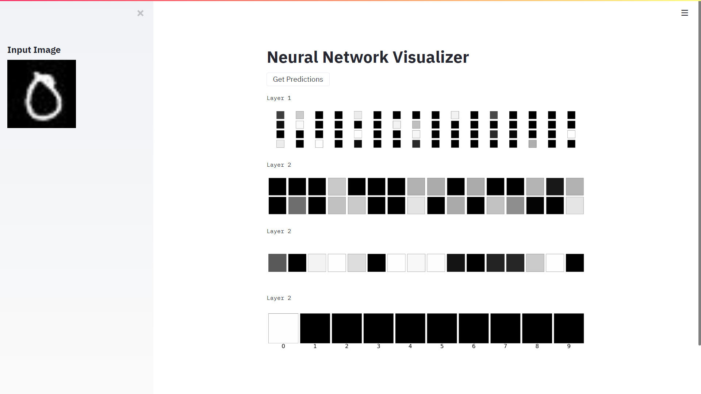

# Neural Network Visualizer
Neural Network Visualizer is a Web App that tries to visualize the inner workings of standard Feed Forward Neural Networks. The app was made using Flask and Streamlit. 

# Requirements
- App
  - Python - 3.x 
  - Flask - 1.1.1
  - Werkzeug - 1.0.0
  - Streamlit - 0.60.0
- Neural Network
  - Tensorflow - 2.x
  - Keras - 2.3.1
  - matplotlib - 3.1.1
  - json - 2.0.9

# Contents
- model.py
  - A standard 4-layered neural network made using the Keras Sequential API 
  - Data preprocessing and training on the standard MNIST dataset
  - The model was trained for 30 epochs and gave a validation accuracy of around 95%
- server.py
  - The local development server made using Flask
  - The server loads the pretrained weights of the model and awaits a GET request
- app.py
  - The app itself, made using Streamlit
  - Takes a random input image from the test set and passes it through the FFNN
  - The outputs of all neurons, and hence the predictions, are visualised on the screen.
The finished product looks like:


The bright boxes represent that the particular neuron fires, the intensity represents its value.
If the output boxes of the final layer show more than one bright box, the box with the highest intensity represent the output of the FFNN.
# Instructions to Replicate Results
- Clone the repository to a working directory on your local machine
- Run ```python model.py``` from the terminal
- To setup the server, run the following command in the terminal: ```python server.py ```
- Check the address of the local server and update app.py: ```URL = 'PATH'```
- To run the app: ```streamlit run app.py```
